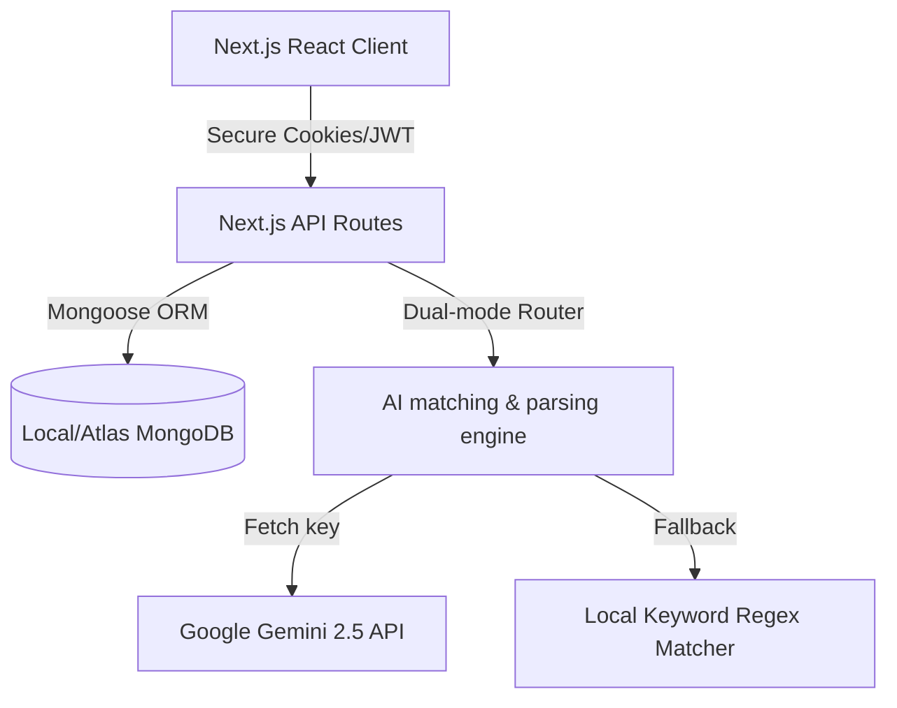
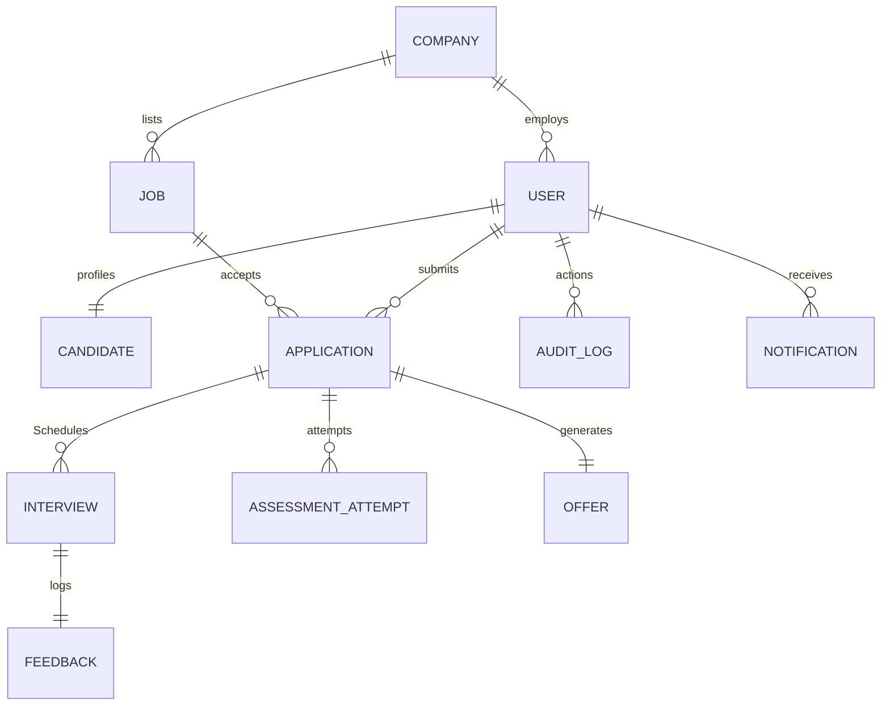

# AI-Powered Applicant Tracking System (ATS)
### DevFusion 4.0 Hackathon — Production Full-Stack Recruitment System

HireNova is a production-ready, full-stack Applicant Tracking System designed to manage the complete recruitment lifecycle. Built using **Next.js**, **TypeScript**, **Mongoose (MongoDB)**, and **Tailwind CSS**, it features role-based dashboards, secure JWT session cookies, automated resume parsing, AI matching scores, interactive coding test environments, calendar schedulers, and offer document generators.

---

## 1. Project Architecture

The application is structured as a full-stack Next.js monorepo containing a React frontend client and Node.js REST API routes inside Next.js App Router folders.



---

## 2. Entity-Relationship (ER) Schema

Mongoose schemas structure 12 key collections mapping candidate, corporate, and system actions:



* **User**: Credential records mapping `candidate | recruiter | manager | interviewer | admin` roles.
* **Company**: Profile metrics (logo, locations, website) for recruiters/hiring teams.
* **Job**: Listing descriptions, minimum experience constraints, and required skills tags.
* **Candidate**: Resume attachments, extracted text data, education history, and portfolio links.
* **Application**: Workflow tracker monitoring stages from screening to hire, alongside AI reports.
* **Interview**: Booking details containing times, types (Technical, HR, Manager), and Google Meet codes.
* **Feedback**: Interviewer scores across 5 competencies (Technical, Solving, Communication, Teamwork, Leadership).
* **Assessment**: Recruiter tests populated with MCQs, SQL queries, algorithm tasks, and timers.
* **AssessmentAttempt**: Candidate responses, compilation scores, and anti-cheating window switch metrics.
* **Offer**: Formal employment contracts specifying salary breakdowns, start dates, and benefits.

---

## 3. Core REST API Endpoints

### Authentication & Sessions
* `POST /api/auth/register` — Create accounts; auto-initialize candidate profiles or link recruiters.
* `POST /api/auth/login` — Validate credentials, issue secure JWT session cookie.
* `POST /api/auth/logout` — Clear secure authentication tokens.
* `GET /api/auth/session` — Fetch current session, company details, and candidate profile.
* `POST /api/auth/verify` — Simulate registration email verification checks.
* `POST /api/auth/forgot-password` — Handle OTP generation codes and password resets.

### Job Management
* `GET /api/jobs` — Advanced search directory supporting location, mode, type, skills, and experience filters.
* `POST /api/jobs` — Recruiter endpoint to create job postings.
* `PATCH /api/jobs/[id]` — Modify positions or archive/close them.
* `DELETE /api/jobs/[id]` — Delete job listings permanently.

### Application Pipeline & AI
* `GET /api/applications` — List applications filtered by company, candidate, or jobs.
* `POST /api/applications` — Candidates apply for jobs, triggering AI match score parsers.
* `PATCH /api/applications/[id]` — Transition candidates across Kanban stages (Screening, Technical, Offer, Hired).

### Evaluation & Scheduling
* `POST /api/interviews` — Schedule interviews with meet link generation and notification dispatches.
* `POST /api/interviews/[id]/feedback` — Log scorecards and evaluations.
* `POST /api/assessments` — Build technical MCQ and coding challenges.
* `POST /api/assessments/[id]/attempt` — Start test timers or compile submitted coding algorithms.

### Offers & Admin
* `POST /api/offers` — Generate formal employment offer letters.
* `PATCH /api/offers/[id]` — Accept or reject generated offers, transitioning candidates to Hired.
* `GET /api/admin/logs` — Retreive system audit log history.

---

## 4. Local Installation & Setup

1. **Prerequisites**: Install Node.js (v18+) and ensure MongoDB is running locally on port `27017` (default).
2. **Environment File**: Rename `.env.example` to `.env` or create `.env.local` and define keys:
   ```bash
    MONGODB_URI=mongodb://127.0.0.1:27017/devfusion-ats
    JWT_SECRET=hirenova-secret-key-12345
   GEMINI_API_KEY=your_gemini_api_key_here # Optional
   ```
3. **Install Dependencies**:
   ```bash
   npm install
   ```
4. **Launch Development Server**:
   ```bash
   npm run dev
   ```
5. **Open Browser**: Visit [http://localhost:3000](http://localhost:3000).

---

## 5. Walkthrough Demo Flow

Our UI includes a **Demo Helper Panel** in the bottom-right corner. It allows judges to switch roles with a single click and run the complete 16-step recruitment story:

1. **Re-Seed Database**: Click **Re-Seed Demo Data** in the helper panel to refresh collections.
2. **Step 1 — Recruiter Logs In**: Click **Recruiter** in the helper panel (Sarah Jenkins).
3. **Step 2 — Job Posting**: Go to **Manage Jobs** and click **Create Job Listing** (e.g., Frontend Developer requiring React, JavaScript, Node.js, MongoDB).
4. **Step 3 — Candidate Logs In**: Click **Candidate** in the helper panel (Arun Kumar).
5. **Step 4 — Resume Upload**: Open **My Profile**, select the **Arun React Presets** button, and click **Upload & Parse** (fills skills and work history instantly using AI parsing).
6. **Step 5 — Apply to Job**: Go to **Find Jobs**, open **Frontend Developer**, and click **Submit Application** (runs AI matching score, e.g. 87% Match).
7. **Step 6 — Recruiter Pipeline**: Switch back to **Recruiter**. Open **Kanban Board** to see Arun in the "Applied" column. Click to view the AI match report.
8. **Step 7 — Screen & Shortlist**: Click the stage dropdown on Arun's card and select **Shortlisted** (sends candidate an in-app notice).
9. **Step 8 — Schedule Interview**: Go to **Interviews**, fill in Arun, select Interviewer (Devon Harris), and click **Confirm Interview Slot** (generates meeting link).
10. **Step 9 — Interviewer Logs In**: Click **Interviewer** (Devon Harris) in the helper panel. See the assigned interview, join meet, and click **Log Feedback** (set slider grades and comments).
11. **Step 10 — Coding Challenge**: Click **Candidate** (Arun). Go to **Assessments**, open **Frontend Technical Challenge**, complete the MCQ and coding blocks, and click **Submit Test**.
12. **Step 11 — Hiring Manager Evaluation**: Click **Manager** (Marcus Aurelius). Review candidate evaluations and interview feedback scores. Click **Approve Hire**.
13. **Step 12 — Generate Offer**: Click **Recruiter**. Go to **Offer Letters**, select Arun, configure salary and joining dates, and click **Publish Offer Contract**.
14. **Step 13 — Accept Offer**: Click **Candidate**. View the offer contract notice on the dashboard. Click **Accept Offer** (transforms application status to Hired).
15. **Step 14 — Verify Funnel**: Go to the **Recruiter** dashboard. Charts will update showing hired candidates count, funnel metrics, and audit log lines.
